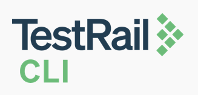
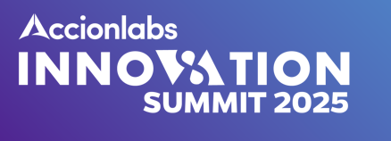

# Accion Labs Innovation Summit - TestRail CLI Integration Demo

This repository demonstrates the use of the TestRail CLI Code-First approach in a conference demo setting. The project is configured to utilize GitHub Actions for CI/CD integration.

## Overview
This demo showcases how to integrate TestRail's Code-First approach using the TestRail CLI with GitHub Actions to streamline test management and automation. It provides an example of how to define test cases in code and automatically sync them with TestRail.

## GitHub Actions Workflow
The included GitHub Actions workflow (`.github/workflows/execute_cli.yml`) is triggered on the following events:
- Push to the `main` branch
- Any pull request to any branch
- Manual trigger from the Actions tab

### Workflow Highlights
- **Setup:** Checks out the code and sets up Python
- **TestRail CLI Execution:** Installs the TestRail CLI (`trcli`) and uploads test results from a JUnit XML report
- **Dynamic Run Information:** The test run title and description are dynamically populated using GitHub Actions environment variables

## License
This project is licensed under the MIT License. 
